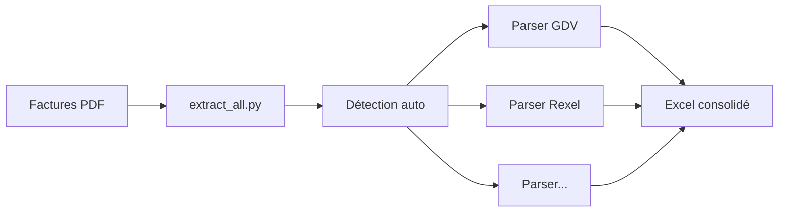

# 📦 Extracteur de Factures Multi-Fournisseurs

Extracteur modulaire et extensible pour traiter les factures PDF de multiples fournisseurs.

## 🎯 Caractéristiques

✅ **Architecture modulaire** : Un fichier par fournisseur
✅ **Détection automatique** : Reconnaît le fournisseur automatiquement
✅ **Extensible** : Ajoutez facilement de nouveaux fournisseurs
✅ **Export Excel** : Toutes les factures dans un seul fichier consolidé

## 🏗️ Structure du projet

```
extracteur_modulaire/
├── extract_invoices.py           # Script principal
├── src/
│   ├── utils.py                  # Fonctions utilitaires
│   └── parsers/
│       ├── __init__.py
│       ├── base.py               # Classe de base
│       ├── gdv.py                # Parser GDV
│       ├── richardson.py         # Parser Richardson
│       ├── rexel.py              # Parser Rexel
│       └── lynelec.py            # Parser Lynelec
└── docs/
    └── AJOUTER_FOURNISSEUR.md    # Guide pour ajouter un fournisseur
```

## 📊 Fournisseurs supportés

| Fournisseur | Status | Type de structure |
|-------------|--------|-------------------|
| GDV        | ✅ | Tableaux structurés |
| Richardson | ✅ | Texte avec points de suite |
| Rexel      | ✅ | Numéros de ligne + désignation |
| Lynelec    | ✅ | Multi-lignes (ref + données) |
| Caparol    | 🔧 | À venir |
| ... | ⏳ | 6 autres à ajouter |

## 🚀 Installation

### Prérequis

```bash
pip install pdfplumber pandas openpyxl --break-system-packages
```

### Structure recommandée

```
Achats_extractInvoice/
├── extract_invoices.py
├── extract_all.py               # Script batch pour dossier
├── src/
│   ├── utils.py
│   └── parsers/
│       ├── __init__.py
│       ├── base.py
│       ├── gdv.py
│       ├── richardson.py
│       ├── rexel.py
│       └── lynelec.py
└── Factures/                    # Vos factures PDF
    ├── facture1.pdf
    ├── facture2.pdf
    └── ...
```

## 💻 Utilisation

### Extraction simple

```bash
# Une ou plusieurs factures
python extract_invoices.py facture1.pdf facture2.pdf

# Toutes les factures d'un dossier (Windows)
python extract_invoices.py Factures\*.pdf

# Toutes les factures d'un dossier (Linux/Mac)
python extract_invoices.py Factures/*.pdf
```

### Script batch pour automatiser

Créez `extract_all.py` :

```python
import glob
from pathlib import Path
import sys

# Ajouter le dossier src au path
sys.path.insert(0, str(Path(__file__).parent))

from src.parsers import ALL_PARSERS
from extract_invoices import process_invoices

# Trouver toutes les factures
pdf_files = glob.glob("Factures/*.pdf")

if pdf_files:
    print(f"✓ Trouvé {len(pdf_files)} fichier(s)")
    process_invoices(pdf_files, output_file='factures_extraites.xlsx')
else:
    print("❌ Aucune facture trouvée dans le dossier Factures/")
```

Utilisation :
```bash
python extract_all.py
```

## 📄 Format de sortie

Le fichier Excel généré contient :

| Colonne | Description |
|---------|-------------|
| Fournisseur | Nom du fournisseur (GDV, REXEL, etc.) |
| Fichier | Nom du fichier PDF source |
| Page | Numéro de page |
| Référence | Référence de l'article |
| Désignation | Description de l'article |
| Quantité | Quantité commandée |
| Montant HT | Montant HT de la ligne |
| ... | Colonnes supplémentaires selon le fournisseur |

## 🔧 Ajouter un nouveau fournisseur

### Méthode rapide

1. **Envoyez-moi un exemple de facture PDF**
2. Je crée le parser personnalisé
3. Ajoutez le fichier dans `src/parsers/`
4. Mettez à jour `src/parsers/__init__.py`

### Méthode autonome

Consultez le guide détaillé : [docs/AJOUTER_FOURNISSEUR.md](docs/AJOUTER_FOURNISSEUR.md)

Template de base :

```python
# src/parsers/nouveau_fournisseur.py
from .base import BaseInvoiceParser
from ..utils import clean_number

class NouveauFournisseurParser(BaseInvoiceParser):
    def __init__(self):
        super().__init__()
        self.supplier_name = "NOUVEAU_FOURNISSEUR"
    
    def can_parse(self, text_content):
        return 'MOT_CLE' in text_content.upper()
    
    def extract(self, pdf_path):
        # Votre logique d'extraction
        return invoice_data
```

Puis ajoutez dans `src/parsers/__init__.py` :

```python
from .nouveau_fournisseur import NouveauFournisseurParser

ALL_PARSERS = [
    # ... parsers existants
    NouveauFournisseurParser(),
]
```

## 🧪 Tests

```bash
# Tester avec une facture
python extract_invoices.py test.pdf

# Tester avec toutes les factures
python extract_all.py

# Vérifier le résultat
python -c "import pandas as pd; print(pd.read_excel('factures_extraites.xlsx'))"
```

## 📈 Workflow recommandé



## 🐛 Dépannage

### "Fournisseur non reconnu"

1. Vérifiez que le mot-clé de détection est présent
2. Testez avec le script d'analyse (voir docs/)
3. Créez un parser personnalisé

### "Aucune donnée extraite"

1. Vérifiez que le PDF contient du texte (pas une image scannée)
2. Analysez la structure avec `pdfplumber`
3. Adaptez les regex du parser

### Erreurs de nombre

La fonction `clean_number()` gère :
- Format français : `1 234,56`
- Format anglais : `1,234.56`
- Avec symboles : `€ 100,00` ou `$100.00`

## 📚 Documentation

- [Guide : Ajouter un fournisseur](docs/AJOUTER_FOURNISSEUR.md)
- [API des parsers](docs/API.md) *(à venir)*
- [FAQ](docs/FAQ.md) *(à venir)*

## 🎯 Roadmap

- [x] Architecture modulaire
- [x] 4 fournisseurs de base
- [ ] Caparol
- [ ] 6 autres fournisseurs
- [ ] Interface graphique (optionnel)
- [ ] Export multi-formats (CSV, JSON)
- [ ] Tests unitaires automatisés

## 🤝 Contribution

Pour ajouter un fournisseur, suivez les étapes dans [AJOUTER_FOURNISSEUR.md](docs/AJOUTER_FOURNISSEUR.md)

## 📝 Licence

Usage interne - Projet personnel

---

**Version** : 6.0
**Dernière mise à jour** : Janvier 2026
**Fournisseurs supportés** : 4/11
